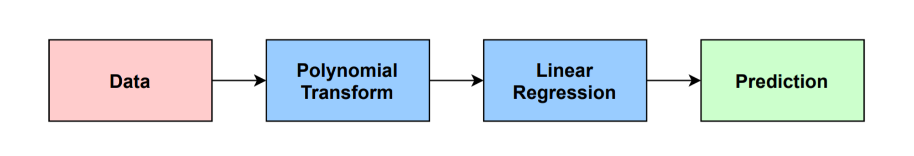
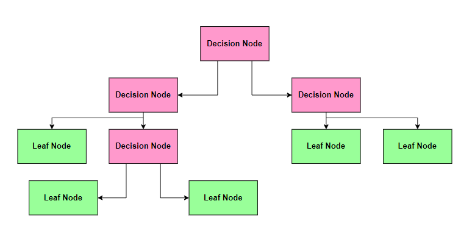

# Bluffing-detector
Bluffing detector using polynomial linear regression, SVR Model and decision tree regression.

# Polynomial Regression

Polynomial regression that uses polynomials is still linear in the parameters. This is because you build the equation by only adding the terms together. So, the performance metrics like R-squared (R²-coefficient of determination) are still valid for polynomial regression. Do not get confused polynomial regression with non-linear regression where R² is not valid.
High degrees can cause overfitting. The problem of overfitting is a condition where a statistical model begins to describe the random error in the data rather than the relationships between variables. In overfitting, the model fits training data very well but fails to generalize for new input data which are not in our dataset.
Lower degrees can cause underfitting. In underfitting, the model does not fit training data very well and also the new data.
When we set the value for the degree hyperparameter, we should always try to avoid both overfitting and underfitting conditions

# Support Vector Regression
SVM essentially does – Simple class separation
It tries to find a line/hyperplane (in multidimensional space) that separates any two classes. Then it classifies the new point depending on whether it lies on the positive or negative side of the hyperplane depending on the classes to predict.
Hyperplane: This is basically a separating line between two data classes in SVM. But in Support Vector Regression, this is the line that will be used to predict the continuous output

# Decision Tree Classisfier

A decision tree is a flowchart-like tree structure where an internal node represents feature(or attribute), the branch represents a decision rule, and each leaf node represents the outcome. The topmost node in a decision tree is known as the root node. It learns to partition on the basis of the attribute value. It partitions the tree in recursively manner call recursive partitioning. This flowchart-like structure helps you in decision making. It's visualization like a flowchart diagram which easily mimics the human level thinking. That is why decision trees are easy to understand and interpret.
